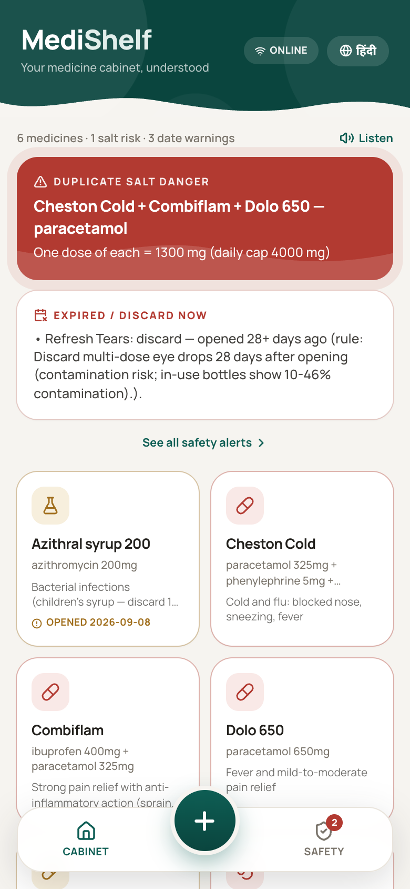
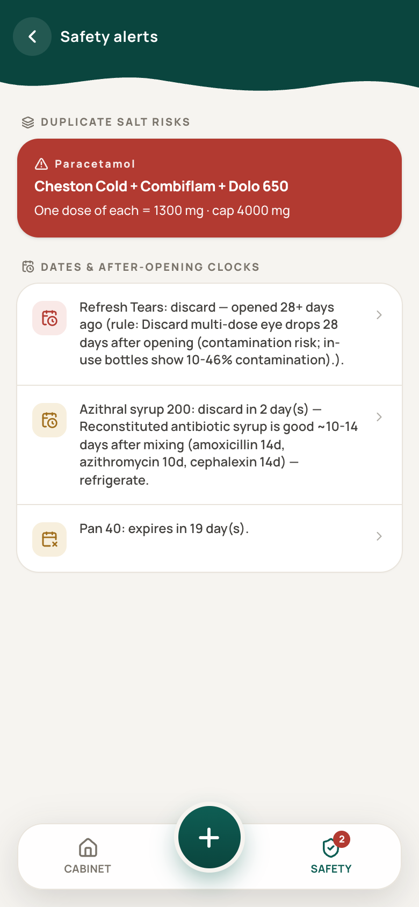
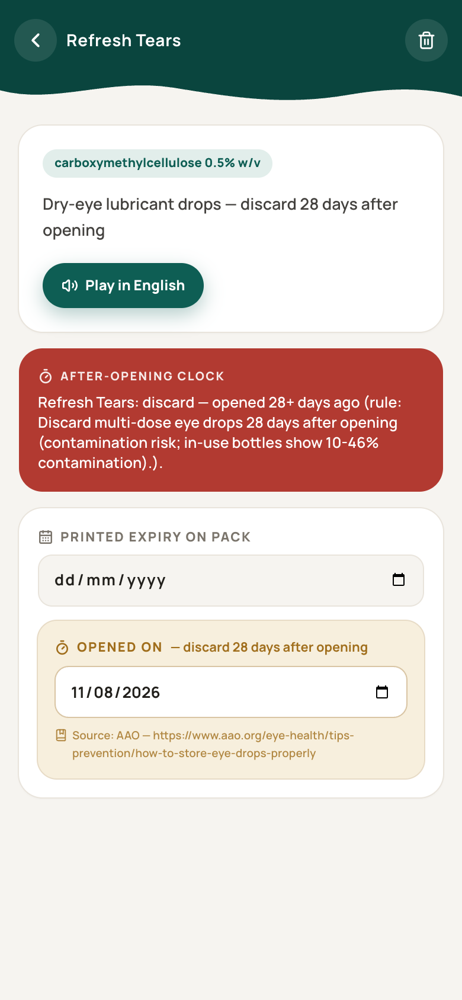
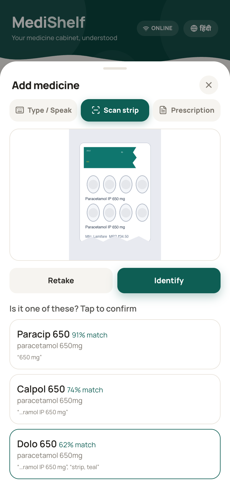
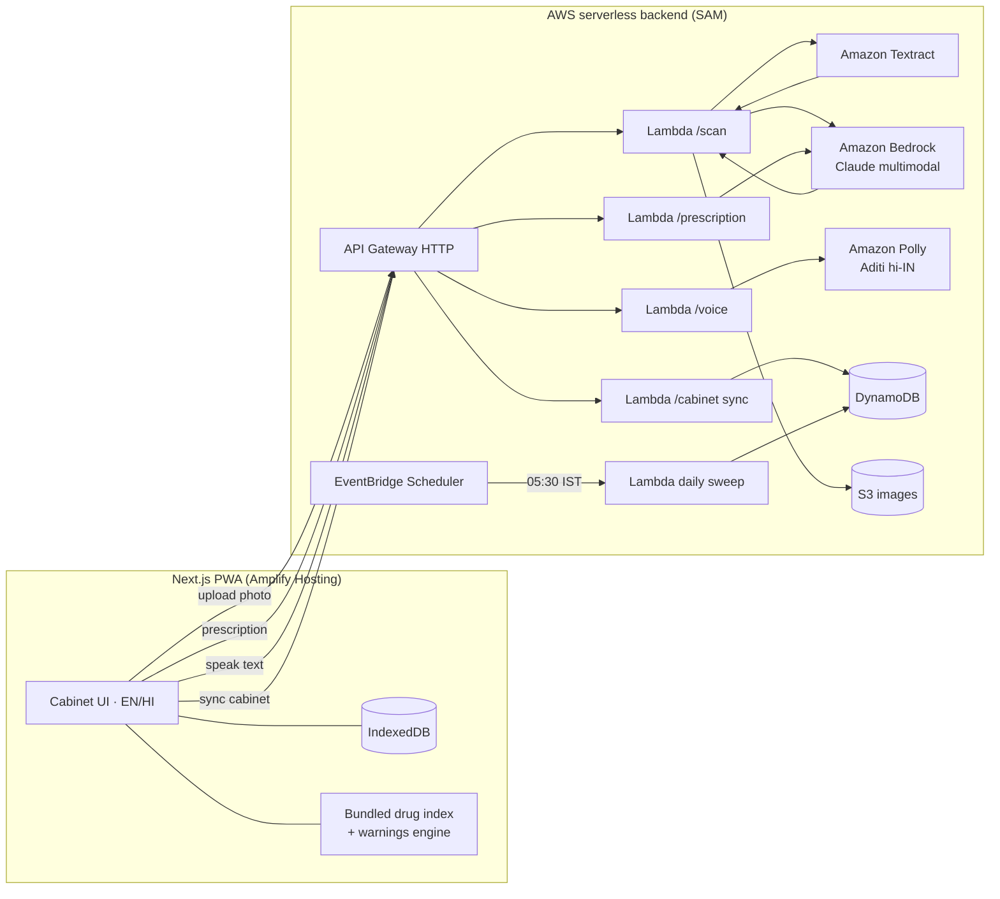

# MediShelf — your medicine cabinet, understood

**WeMakeDevs × AWS "First Commit" (Sept 17–20, 2026) · Ship It track**

## 🚀 Live
**[MediShelf](https://main.d2h6irovbh2zum.amplifyapp.com/)**

## 🎬 Demo

▶️ **[Watch the 2-minute demo video on YouTube](https://youtube.com/shorts/OafiBDC5rfY?feature=share)**

| Duplicate-salt danger | Safety alerts | After-opening clock | Torn-strip scan |
|---|---|---|---|
|  |  |  |  |

MediShelf is an offline-capable medicine-cabinet PWA. Photograph a medicine strip and it identifies the salt and purpose, warns when two products in your cabinet share a salt (the classic Dolo-650 + cold-medicine paracetamol stacking risk), starts **after-opening discard countdowns** that the printed expiry never tells you about (eye drops: 28 days, reconstituted antibiotic syrups: 10–14 days), and matches a doctor's prescription against what you already own — in English and हिंदी, with voice.

> ⚠️ Informational only — not medical advice. Always follow the printed label and ask a pharmacist. Category after-opening rules cite AAO/CDC and manufacturer guidance; **the printed label always wins**.

## The problem

Indian households store medicines nobody can interpret: strips whose brand name is torn off, cold remedies hiding paracetamol inside combination formulas, and eye drops used months past their safe 28-day in-use window (in-use bottles show 10–46% contamination). Recording expiry dates is solved; **interpreting the cabinet** is not. A chatbot can answer one question about one medicine — it cannot hold cabinet state, run countdown timers, compute cross-product salt intersections, or work in airplane mode. MediShelf is built for exactly that.

## The input ladder (designed for real-world failure)

1. **Scan** (online): photo → Amazon Textract OCR → Amazon Bedrock multimodal vision reads torn/partial labels → fuzzy match against the bundled Indian drug index → **top-3 confirm cards** (never an auto-commit guess).
2. **Type / autocomplete** (fully offline): deterministic lookup against the bundled index.
3. **Speak** (mic): Web Speech API fills the same offline lookup.
4. **Prescription photo** (online): Bedrock reads salts from the prescription → user confirms/edits → deterministic cross-match against the cabinet: *you already have it / same salt different strength / same-family caution / missing*.

## Architecture



- **shared/** — one TypeScript safety engine (salt normalization, duplicate-salt stacking with per-salt caps, printed-expiry + after-opening flags, prescription matching, Levenshtein/trigram fuzzy ranking) used identically by the browser (offline) and Lambda (server-side sweep). 19 unit tests.
- **data/** — curated index of 140 common Indian household medicines (brand → salts → purpose → pack type → PAO category, EN+HI) and the PAO rules table with citations; `data/scripts/merge_kaggle.py` folds in the Kaggle All-India Drug Bank (253k products) for long-tail coverage.
- **frontend/** — Next.js 16 + Tailwind PWA; offline-first (IndexedDB source of truth, service worker + cache warm-up, airplanemode-safe type path); scan/prescription degrade honestly with a "use Type/Speak" message.
- **backend/** — SAM template + 5 Lambda handlers (Node 20, ARM64, esbuild-bundled): `/scan`, `/prescription`, `/voice`, `/cabinet`, and a daily EventBridge sweep that recomputes every household's safety report server-side.

## AWS services used (why each matters)

| Service | Role |
|---|---|
| **Amazon Textract** | first-pass OCR of strip photos |
| **Amazon Bedrock** (Claude multimodal) | torn-label reading, prescription extraction, plain-language purpose text |
| **Amazon Polly** (Aditi, hi-IN) | spoken cabinet summary and item explanations |
| **AWS Lambda** ×5 + **API Gateway** | scan, prescription, voice, sync, daily sweep |
| **Amazon DynamoDB** | household cabinet + server-computed safety report |
| **Amazon S3** | scan image audit copy |
| **EventBridge Scheduler** | daily 05:30 IST safety sweep |
| **Amplify Hosting** | PWA hosting (deployment target) |

## Run locally

```bash
# frontend (dev server)
cd frontend && npm install && npm run dev

# production build → fully static out/ (works offline, serves anywhere)
npm run build && npm run serve   # http://localhost:3111

# shared engine tests (no deps needed)
cd shared && node --experimental-strip-types --no-warnings --test src/engine.test.ts

# backend (needs AWS credentials + SAM CLI)
cd backend && npm install && npm run build && sam build && sam deploy --guided
#   then: NEXT_PUBLIC_API_URL=<ApiUrl output> npm run build (in frontend/)
```

No backend configured? Everything except scan/prescription/voice still works — that's the offline-first design.

Search understands how India actually types and speaks: salt names (`paracetamol`, `azithromycin`), prescription shorthand (`pcm`, `azm`), Hinglish symptoms (`bukhar`, `khansi`, `dast`), and Devanagari (`डोलो`, `बुखार`) — all offline, all unit-tested.

## Mobile app (Capacitor)

The web build *is* the app: `output: "export"` produces a fully static bundle that Capacitor wraps into native projects — one codebase, Android + iOS + PWA.

```bash
cd frontend
npm run apk        # build → sync web assets → gradle assembleDebug
# APK: android/app/build/outputs/apk/debug/app-debug.apk  (sideload: adb install)
```

- Android SDK at `~/Library/Android/sdk` (Android Studio's default) is picked up automatically via `android/local.properties`.
- iOS (needs Xcode + a free Apple ID): `npx cap add ios && npx cap sync` → open `ios/App` in Xcode → run on a device. App Store/TestFlight needs the $99 developer account — skip for the hackathon.
- PWA stays the primary install path for judges (Add to Home Screen); the APK is the "hold it in your hand" proof.

Changed web code? Re-run `npm run cap:sync` (or just `npm run apk`) before rebuilding.

## Demo quick path

Load the demo cabinet (button on the empty home screen): it seeds Dolo 650 + Cheston Cold + Combiflam (triple paracetamol → red 1300 mg warning), Refresh Tears opened 40 days ago (28-day discard flag), Azithral syrup opened 12 days ago, and Pan 40 expiring in 20 days. Then try typing `meftal`, toggle हिंदी, press 🔊, and turn on airplane mode.

## Repo map

```
medishelf/
├── shared/          # safety engine (types, engine, cabinet) + tests + generated data
├── data/            # drug-index.json (140), pao-rules.json, scripts (gen, kaggle merge)
├── frontend/        # Next.js PWA (src/app, src/components, src/lib)
├── backend/         # SAM template + Lambda handlers (src: scan, prescription, voice, sync, cron)
└── docs/            # architecture, deploy runbook, video script, screenshots
```

## Sources for the safety rules

- Eye drops 28 days after opening: [AAO](https://www.aao.org/eye-health/tips-prevention/how-to-store-eye-drops-properly), [CDC](https://www.cdc.gov/healthywater/hygiene/healthy-eyes/eye-drops.html)
- Reconstituted antibiotic syrups 10–14 days: [GoodRx](https://www.goodrx.com/classes/antibiotics/how-long-do-liquid-antibiotics-last), Cleveland Clinic
- In-use insulin ~28 days: manufacturer patient inserts (Lilly/Sanofi/Novo)
- Paracetamol 4 g/day adult cap and combination-product overdose risk: [LITFL](https://litfl.com/paracetamol-toxicity/), [PMC7336293](https://pmc.ncbi.nlm.nih.gov/articles/PMC7336293/)
